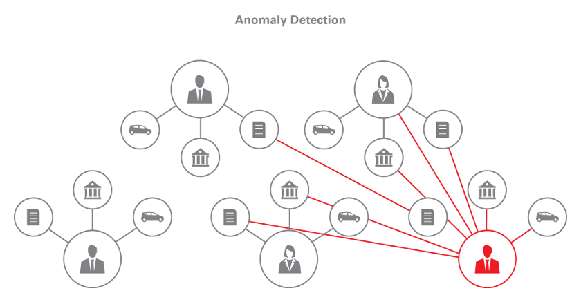
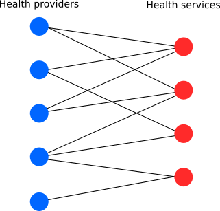

# Detect Anomalies in a Healthcare System

In this example, we detect anomalies in medical transactions through a graph analysis procedure implemented with PGX.
The result can be further investigated to identify potential fraud in the healthcare system.
The example was inspired by this [article from Hortonworks](http://hortonworks.com/blog/using-pagerank-detect-anomalies-fraud-healthcare/).



We use a public data set of medical transactions from **CMS** (the United States Center for Medicare and Medicaid Services) 
for the year 2012.  The transactions are between over 880,000 medical providers and CMS where the total amounts to more than $77B for the year. 
The original dataset is available from [CMS website](http://www.cms.gov/Research-Statistics-Data-and-Systems/Downloadable-Public-Use-Files/Part-B-National-Summary-Data-File/Overview.html).

Here, we first show how to convert the data into a graph representation. Then we discuss how to use PGX to analyze the graph data. 

## Download the data set

You have to download the dataset manually from [CMS repository](http://www.cms.gov/apps/ama/license.asp?file=http://download.cms.gov/Research-Statistics-Data-and-Systems/Statistics-Trends-and-Reports/Medicare-Provider-Charge-Data/Downloads/Medicare_Provider_Util_Payment_PUF_CY2012_update.zip). You have to agree with terms of use of the dataset. Extract the data file `Medicare_Provider_Util_Payment_PUF_CY2012.txt` and store it to `use-case/healthcare/data` directory in this repository.

## Convert the data into EDGE_LIST graph format

First we need to convert the data file into [EDGE_LIST format](https://docs.oracle.com/cd/E56133_01/latest/reference/loader/file-system/plain-text-formats.html) graph format. The conversion script is stored in `use-cases/healthcare/src/generateGraph.groovy` ([show online](src/generateGraph.groovy)). To run it, please, open the terminal, move the working directory to `use-cases/healthcare/src` and run `pgx generateGraph.groovy`.

The output of the script consists of two files:

1. `outputFile` is the file where the graph is going to be written. 
2. `specialtiesOutFile` is the file where the distinct specialties are going to be written. We need them later as an additional input for our analysis.


	You may need to increase the JVM default heap memory size. To do so you will need to run the following command:
	`export JAVA_OPTS="-Xmx2048M"`
	We recommend to increase it at least to 2 GB since the data set requires around 1.2 GB.

Note that the above script converts the data set into a [bipartite graph](https://en.wikipedia.org/wiki/Bipartite_graph), with the left-hand side as health care providers and the right-hand side as health services. The resulting graph would look like this:



## Detect Anomalies Introduction

The idea behind the anomaly detection is as follows.

  * An edge in the above graph corresponds to a specific medical provider (the left-hand side vertex) 
    who provided a specific health service (the right-hand side vertex). There exists a two-hop (undirected) path between two medical providers, 
    for each of the common health service that they both provide. 
  * Therefore the more common services they provide, the *closer* the medical providers become to each other in the graph,
    in a sense that they are connected through many short (two-hop) paths. 
  * On the other hand, the data set also specifies the "specialties" of medical providers.  Since medical providers of 
    the same specialty would likely perform many common services, these vertices are expected to be *closer* to one another 
    than the others.
  * If there is a medical provider who is exceptionally close to other providers with different 
    speciality, it is considered anomalous -- the provider is performing health services typically
    done by providers with a different speciality. 

In order to compute this *closeness* among vertices, we use [Personalized Pagerank(PPR)](https://docs.oracle.com/cd/E56133_01/latest/reference/algorithms/index.html).  Specifically, for each
specialty, we compute the PPR score of all the providers by setting only vertices of the current specialty as starting vertices. The PPR
score of a given vertex represents the probability that random walks from the starting vertices end at this vertex. Consequently, a high PPR score for a vertex
indicates that the vertex is *close* to the starting vertices.

After computing PPR score per specialty, we cross-check the values to identify anomalies. That is, we look up highest ranked vertices and see if
they do belong to the current specialty. If not, the provider is considered anomalous.

We present two implementations of this analysis in the following subsections. The first approach makes use of the [built-in Personalized PageRank algorithm](https://docs.oracle.com/cd/E56133_01/latest/reference/algorithms/pagerank.html). The second one improves memory consumption and performance of the analysis by writing and compiling a custom graph algorithm with Green-Marl.


### Detect Anomalies Using Personalized PageRank

The analysis is implemented in the `use-cases/healthcare/src/healthcare-pagerank.groovy` ([show online](src/healthcare-pagerank.groovy)). To run the analysis, please, open the terminal, move the working directory to `use-cases/healthcare/src` and run `pgx healthcare-pagerank.groovy`.

Let us take a closer look at what the script does:

1. Read the specialties into a list
2. Create a [graph config](https://docs.oracle.com/cd/E56133_01/latest/reference/loader/graph-config/index.html) referencing the bipartite graph. The specialties associated with each provider is loaded as a `string` vertex property.
3. Read the graph into memory
4. Create an undirected copy of the graph
5. Iterate over all specialties. For each specialty,
  1. Find all vertices in the graph associated with the current specialty.
  2. Run the built-in personalized pagerank algorithm on the undirected graph biased towards our found vertices with a damping factor `0.85`, a maximum error difference of `0.001` and a maximum number of iterations `1000`.
  3. Create a subgraph containing all the providers which are not associated with the current specialty.
  4. Print the top 10 providers in that subgraph with the highest personalized PageRank score.


The output will be something in the format of below:

```
==> Iterating over all specialties
Pain Management
             suspect              pagerank
============================================
          1124020011   0.03378340111411831
          1023236478   0.03188995380346009
          1356353247   0.03125303489326371
          1689644668  0.031087249961419247
          1043213259   0.03092537640401708
          1952347981   0.03041650032484901
          1568465763  0.029535881620308922
          1982872990  0.028917315945686653
          1538130018  0.028529067396474646
          1629071527   0.02803827130175676
Pathology
             suspect              pagerank
============================================
          1134277494    1.7097787102012583
          1346233277    1.6401878728267945
          1194769497    1.6374635275343175
          1932145778    1.4326716377223467
          1538105366    1.4233972566122781
          1497773337    1.4107892152282349
          1205896594    1.3572755649336943
          1538144910    1.3541746206567151
          1366543795    1.3011186472395846
          1548280852    1.2980797553943368
...
```

The PgxVertex ID matches the actual NPI (National Provider Identifier). Using this identifier, we can cross-check whether the specialties a provider ranks high in matches the expected specialty in order to detect anomalies.

### Detect Anomalies Using a *Custom* Personalized PageRank

The following script also uses the Pagerank analysis. In addition it uses custom implementation which directly takes advantage of the `specialty` property instead of creating a vertex set first. The custom implementation of the PageRank algorithm is available in `use-cases/healthcare/src/personalized_pagerank_from_kind.gm` ([show online](src/personalized_pagerank_from_kind.gm)).

> More information about Green-Marl syntax is available in [Green-Marl language specification](https://docs.oracle.com/cd/E56133_01/latest/Green_Marl_Language_Specification.pdf).

The groovy script running the custom pagerank is available in `use-cases/healthcare/src/healthcare-custom-pagerank.groovy` ([show online](src/healthcare-custom-pagerank.groovy)). To run the script, again use `pgx healthcare-custom-pagerank.groovy` in the `use-cases/healthcare/src` directory.

Note the following differences to the previous script:

* we compile the `personalized_pagerank_from_kind.gm` program into the `pprFromKind` variable,
* we create a vertex property of type `double` to hold the computed PageRank values (see the output argument of the `personalized_pagerank_from_kind.gm` program),
* we invoke `pprFromKind` using the current `specialty` string and the `specialty` vertex property as input arguments.

Although the output of this script is exactly the same, due to removal of vertex sets, the analysis reguires less memory and the execution is roughly 20% faster.


# Summary

* The anomaly detection analysis can easily be done with PGX.
* When executed on a single server-class machine, the entire analysis was finished under 5 minutes. 

